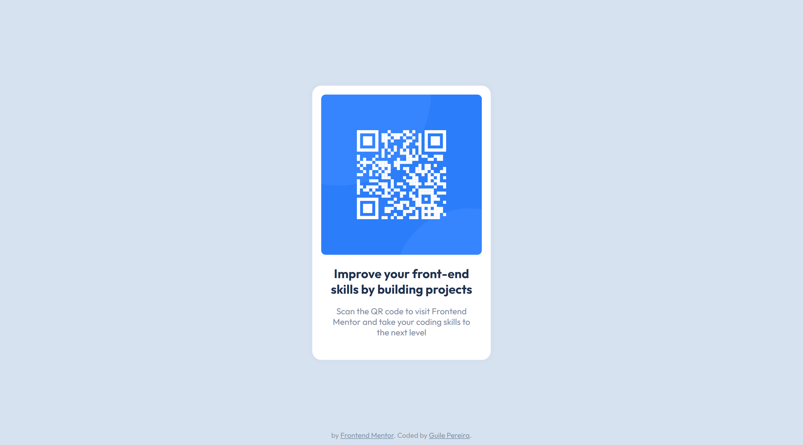
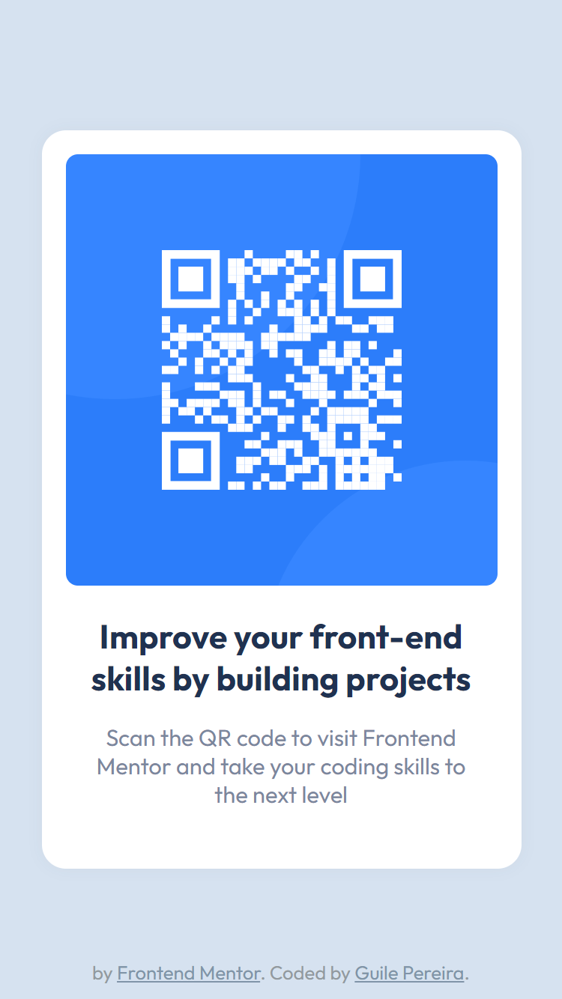

# Frontend Mentor - QR code component solution

This is a solution to the [QR code component challenge on Frontend Mentor](https://www.frontendmentor.io/challenges/qr-code-component-iux_sIO_H). Frontend Mentor challenges help you improve your coding skills by building realistic projects. 

## Table of contents

- [Overview](#overview)
  - [Screenshot](#screenshot)
  - [Links](#links)
- [My process](#my-process)
  - [Built with](#built-with)
  - [What I learned](#what-i-learned)
  - [Continued development](#continued-development)
  - [Useful resources](#useful-resources)
- [Author](#author)
- [Acknowledgments](#acknowledgments)

## Overview

### Screenshot
| Desktop | Mobile |
|---|---|
|||

### Links

- Live project on [GitHub](https://guilepereira.github.io/html-css/qr-code-component-main/)

- Solution on [Frontend Mentor]()

-------

## My process

My process consisted of developing the design for desktop, following with tests and subsequent code organization. After this step, I started the development of responsiveness, always following the requirements of the challenge specification as much as possible.

### Built with

- Semantic HTML5 markup;
- CSS custom properties;
- Mobile First;
- Accessibility.

### What I learned

The main objective was to regain practice, which I intend to improve with feedback and learning from these first exercises.

As one of my first exercises, I was able to think about a process in an experimental way, aware of some good practices, I chose to start simple and apply the best I could.

### Continued development

Use this section to outline areas that you want to continue focusing on in future projects. These could be concepts you're still not completely comfortable with or techniques you found useful that you want to refine and perfect.

## Author

- LinkedIn - [Guile Pereira](https://www.linkedin.com/in/guilevpereira/)
- GitHub - [Guile Pereira](https://github.com/guilepereira)
- Frontend Mentor - [@guilepereira](https://www.frontendmentor.io/profile/guilepereira)

